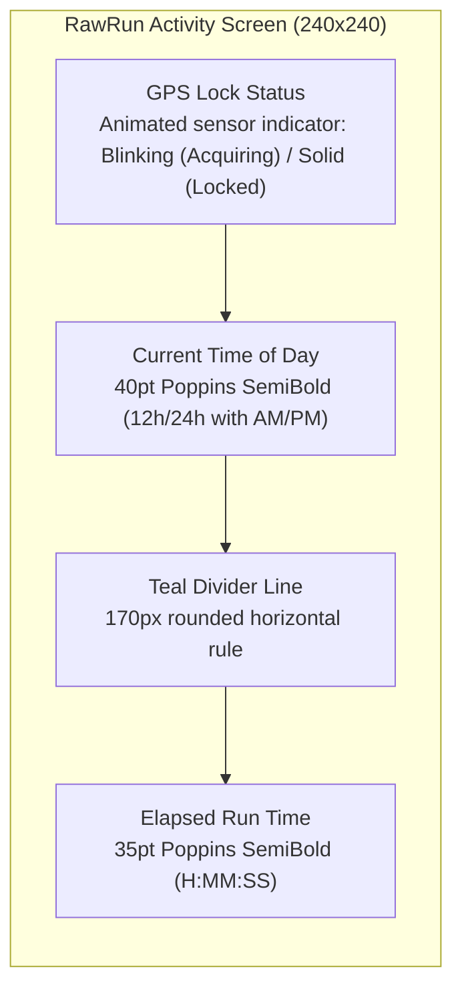
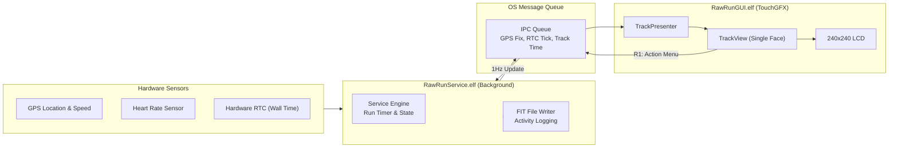

# RawRun

>  Sometimes you just need to go out and run and clear the mind - you can look at the data later.
>  Minimal, high-contrast running activity tracker for the UNA Watch — focused single-screen view with GPS lock indicator, current time of day, and elapsed run time.


A streamlined running activity app designed for the [UNA Watch](https://unawatch.com) (240×240 display).

```
+---------------------------------------+
|             240 x 240 px              |
|                                       |
|               [GPS ●]                 |  <- 1. GPS Lock Indicator
|                                       |     (Blinks searching, solid when locked)
|                                       |
|                 TIME                  |  <- 2. Current Time of Day
|               10 : 42                 |     (40pt SemiBold, 12h/24h with AM/PM)
|                                       |
|       -------------------------       |  <- Teal Divider Line
|                                       |
|               ELAPSED                 |  <- 3. Elapsed Run Time
|              0 : 24 : 15              |     (35pt SemiBold H:MM:SS)
|                                       |
|  [■ Pause/Menu]                       |  <- R1: Action Menu (Pause / Stop)
+---------------------------------------+
```



## Features

- **Focused Single-Screen UI**: No distractions and no scrolling between multiple faces while running. Everything you need is visible on a single high-contrast screen.
- **1. GPS Lock Status Indicator**: Top-center icon providing immediate visual feedback on GPS satellite fix status (blinking while searching, solid when lock is acquired).
- **2. Current Time of Day**: Prominent time-of-day clock rendered in 40pt typography. Respects system 12-hour (with AM/PM suffix) or 24-hour time preferences.
- **3. Elapsed Run Time**: High-contrast running stopwatch (`H:MM:SS`) tracking total elapsed activity duration from start to finish.
- **One-Touch Action Controls**: Quick access to the Pause / Stop / Discard menu via the top-right physical button (R1).
- **FIT Activity Logging**: Full activity recording in the background into standardized FIT format for export to Strava and training platforms.

## Architecture

Built using the UNA Watch SDK two-process model:



1. **Service (`RawRunService.elf`)**: Background daemon managing GPS fix monitoring, elapsed run timer calculation, and writing activity FIT files to flash storage.
2. **GUI (`RawRunGUI.elf`)**: Foreground TouchGFX process displaying the single-screen running activity face and handling button interactions.

## Building

### Prerequisites

- [UNA Watch SDK](https://github.com/UNAWatch/una-sdk)
- ST ARM GCC Toolchain (`arm-none-eabi-gcc` Cortex-M33, e.g. from STM32CubeIDE / STM32CubeCLT)
- CMake 3.21+ and GNU Make
- Python 3 with requirements from `$UNA_SDK/Utilities/Scripts/app_packer/requirements.txt`

### Build Instructions

```bash
# 1. Set UNA SDK path
export UNA_SDK="/Users/scottcowie/repos/una-sdk"

# 2. Configure build
cmake -B build Software/Apps/RawRun-CMake

# 3. Build and package .uapp
cmake --build build
```

The compiled package will be generated at:
```text
build/RawRun_0.0.1.uapp
```

## License

This project is licensed under the Apache 2.0 License - see the UNA Watch SDK documentation for details.
