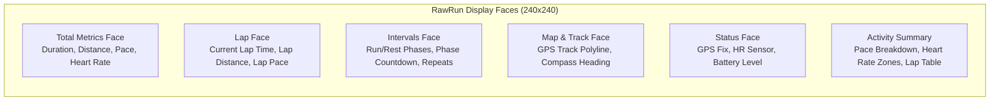
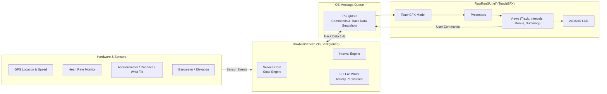

# RawRun

> Real-time running activity tracking for the UNA Watch — GPS, heart rate, cadence, interval workouts, and FIT activity logging.

A comprehensive running activity tracker designed for the [UNA Watch](https://unawatch.com) (240×240 display).

```
+---------------------------------------+
|             240 x 240 px              |
|                                       |
|  [GPS ●]                   [BAT 95%]  |
|                                       |
|               05 : 24                 |  <- Time / Duration
|                                       |
|    5.42 km               148 bpm      |  <- Distance & HR
|                                       |
|             04'32" /km                |  <- Current Pace
|                                       |
+---------------------------------------+
```



## Features

- **Real-Time Running Metrics**: High-contrast, live metrics displaying duration, distance, instantaneous and average pace, current/average/max heart rate, and cadence (steps per minute).
- **GPS Tracking & Breadcrumb Map**: Integrates GPS location and speed sensors with real-time polyline rendering of your route.
- **Interval Training**: Built-in interval workout engine supporting customizable warm-up, run, rest, and cool-down phases with time- or distance-based boundaries and repeat counts.
- **Automatic & Manual Lap Splitting**: Auto-lap triggers based on distance or time thresholds, plus manual lap splitting.
- **Smart Wrist-Raise Detection**: Custom accelerometer gesture detector tuned for running swing physics, waking the display cleanly on wrist tilt while rejecting stride motion artifacts.
- **FIT Activity Recording**: Automatically writes standardized FIT activity files with session, lap, and record messages for export to Strava and training platforms.
- **Sensor Integration**:
  - GPS Location & Speed
  - Heart Rate Monitor with trust level assessment
  - Running Cadence
  - Barometric Altimeter / Elevation tracking
  - Battery Level monitor

## Architecture

Built using the UNA Watch SDK two-process model:



1. **Service (`RawRunService.elf`)**: Background daemon managing sensor subscriptions, pace/lap/interval state machines, and writing activity FIT files to flash storage.
2. **GUI (`RawRunGUI.elf`)**: Foreground TouchGFX process rendering screens, interval timers, zone visualizations, and breadcrumb tracks.

## Building

### Prerequisites

- [UNA Watch SDK](https://github.com/UNAWatch/una-sdk)
- ST ARM GCC Toolchain (`arm-none-eabi-gcc` Cortex-M33, e.g. from STM32CubeIDE / STM32CubeCLT)
- CMake 3.21+ and GNU Make
- Python 3 with requirements from `$UNA_SDK/Utilities/Scripts/app_packer/requirements.txt`

### Build Instructions

```bash
# 1. Set UNA SDK path
export UNA_SDK="/path/to/una-sdk"

# 2. Configure build
cmake -B build Software/Apps/RawRun-CMake

# 3. Build and package .uapp
cmake --build build
```

The compiled package will be generated at:
```text
build/RawRun_0.0.1.uapp
```

## License

This project is licensed under the Apache 2.0 License - see the UNA Watch SDK documentation for details.
